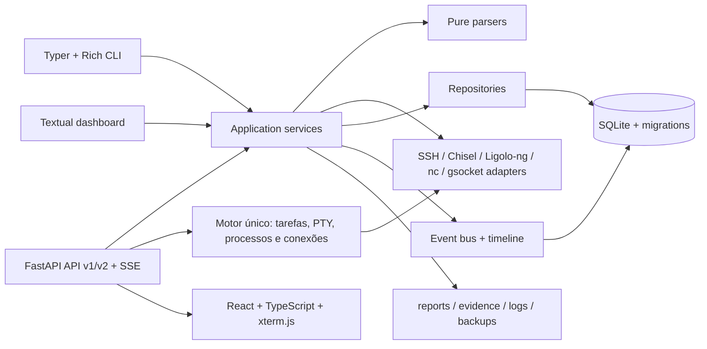
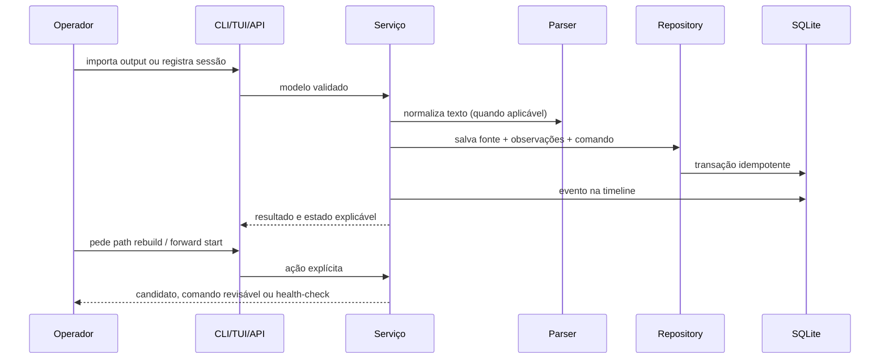

# CTF Workspace — arquitetura V0.28

O CTF Workspace é um console local-first para organizar infraestrutura observada em
CTFs/laboratórios autorizados. Ele não explora alvos, faz brute force, inicia túneis de forma
implícita ou remove evidências.

## Visão de componentes



## Fluxo operacional



## Capacidades

| Área | Estado | Entrada principal | Saída |
| --- | --- | --- | --- |
| Workspace | Implementado | `lab create`, `--workspace` | pasta isolada + SQLite |
| Observações | Implementado | `import ip/route/neigh/ss/hosts/resolv/system` | registros normalizados |
| Proveniência | Implementado | import manual ou agente | hash SHA-256, origem, comando |
| Snapshots | Implementado | `snapshot create`, `--snapshot` | rodada nomeada de evidência |
| Rede | Implementado | interfaces, rotas, neighbors, sockets | redes, serviços, conexões |
| Relações | Implementado | `relationship rebuild` | relações com evidência/confiança |
| Caminhos | Implementado | `path rebuild` | hops de hosts/sessões e confidence |
| Sessões | Implementado | `session add/check/close` | lifecycle + health |
| Forwards | Implementado | `forward add/start/stop/check` | plano/processo/health; listeners AsyncSSH no dashboard |
| Perfis SSH | Implementado | `profile add/list/parse` ou API v1 | metadados sem senha; `ProxyJump` tipado, cadeia limitada e erros SSH categorizados |
| Terminais gerenciados | Implementado | dashboard/API v1/v2 | terminal local/SSH, PTY compartilhado AsyncSSH + WebSocket; proprietário, privado/compartilhado e controle de entrada |
| Arquivos do workspace | Implementado | API v1 + SFTP compartilhado | upload/listagem/download em streaming, hash e verificação remota |
| Transportes | Implementado | SSH, Chisel, Ligolo-ng, nc, gsocket | catálogo de capacidades/papéis/local, prévia sem persistência; SSH/SOCKS do dashboard com listeners AsyncSSH; demais adapters em planos explícitos |
| Shells/tmux | Implementado | `shell`, `tmux` | registro e planos determinísticos |
| Topologia | Implementado | `map`, `topology export` | texto, DOT e PNG quando `dot` existe |
| Ferramentas | Implementado | catálogo na UI/API + `tool_transfer` | hash, arquitetura, versão e envio explícito sem execução |
| Relatórios | Implementado | `report --format md/html/all` | relatório reproduzível |
| Operação | Implementado | `doctor`, `backup`, `restore` | diagnóstico + backup SQLite |
| Auditoria | Implementado | API `/audit` e middleware de mutações | ator, ação, resultado e correlação |
| Membership por workspace | Implementado no motor único | API `/workspaces/{id}/members` | papel efetivo e isolamento opcional por configuração |
| Autenticação OIDC | Implementado no motor único | JWT RSA + JWKS configurado por ambiente | bearer validado sem persistir token |
| API/dashboard | Opcional | `pip install -e ".[web]`; `web` | API JSON + dashboard local |

## Modelo de dados operacional

```text
lab
├── hosts
│   ├── interfaces ── source_id ──> observation_sources
│   ├── routes     ── source_id ──> observation_sources
│   ├── neighbors  ── source_id ──> observation_sources
│   ├── services   ── source_id ──> observation_sources
│   ├── connections── source_id ──> observation_sources
│   ├── shells
│   └── sessions
├── networks (reachable_via_json)
├── access_paths (hop_host_ids_json + hop_session_ids_json)
│   └── access_path_checks (prova TCP explícita, TTL)
├── pivots
├── forwards ── session_id ──> sessions (engine_id do motor)
├── connection_profiles (sem segredos, geração e capacidades observadas)
├── terminal_sessions ── connection_id ──> connection_profiles
│   └── owner_subject + sharing + engine_id (private/shared)
├── workspace_tasks (jobs 202, progresso e idempotência)
├── collection_runs (coletas parciais e parser)
├── network_contexts (SOCKS/roteado, diagnóstico, capacidades, namespace + identidade do processo/motor)
├── transfers (bytes, hashes e integridade)
├── tool_catalog (arquitetura, versão e hash; nunca executado automaticamente)
├── snapshots ──> observation_sources
├── commands ── source_id/snapshot_id
├── notes / evidence / tags
├── audit_log (ator, ação, recurso, resultado e correlação)
├── workspace_memberships (subject, papel e revisão temporal)
└── events
```

O motor adquire `motor.lock` durante o ciclo de vida do servidor. O lock contém o PID e a
`engine_id` efêmera da instância; isso permite identificar/remover um lock stale e correlacionar
o proprietário com os forwards, contextos e terminais ativos. Ele impede que duas instâncias
assumam esses recursos simultaneamente.

## Estados importantes

| Entidade | Estados | Regra de segurança |
| --- | --- | --- |
| Access path | candidate, ready, verified, stale, failed | inferência nunca é apresentada como execução confirmada |
| Session | planned, connecting, active, degraded, lost, closed, error | `check` somente observa o PID; `close` não mata processo externo |
| Forward | planned, starting, active, degraded, stopped, error | `start` exige confirmação, revalida o listener e grava log do processo |

## Adapters de transporte

| Adapter | Gera | Requer confirmação |
| --- | --- | --- |
| SSH | `-L`, `-R`, `-D`, keepalive e `ExitOnForwardFailure` | host key, destino e processo local |
| Chisel | cliente/servidor, `socks`, port mapping e reverse mapping | endpoint, auth/fingerprint e processo local |
| Ligolo-ng | agente/proxy e fingerprint opcional | execução remota/contextual explícita; processo local do motor bloqueado |
| Netcat | cliente/servidor de fluxo TCP único | não é shell independente nem acesso roteado |
| gsocket | cliente/servidor explícito | ferramenta externa opcional e endpoint |

Adapters não recebem credenciais secretas; `auth_ref` é somente uma referência para o operador
resolver no ambiente seguro. Cada plano persistido também registra `role` e `execution_location`;
o motor recusa iniciar um plano remoto/contextual ou um agente Ligolo como processo local.

## Qualidade verificada

```text
pytest: 113 passed, 1 skipped on Windows (Unix socket contract)
ruff: PASS
black --check: PASS
mypy ctfws: PASS
compileall: PASS
npm run check: PASS
npm run build: PASS
CLI: ctfws 0.28.0 / schema 33
```

As integrações web, frontend e CLI também são exercitadas em workspaces temporários: criação de
lab, snapshot, import com provenance, reconstrução de paths, verificação TCP, jobs, doctor,
backup/restore e `/api/health`.
